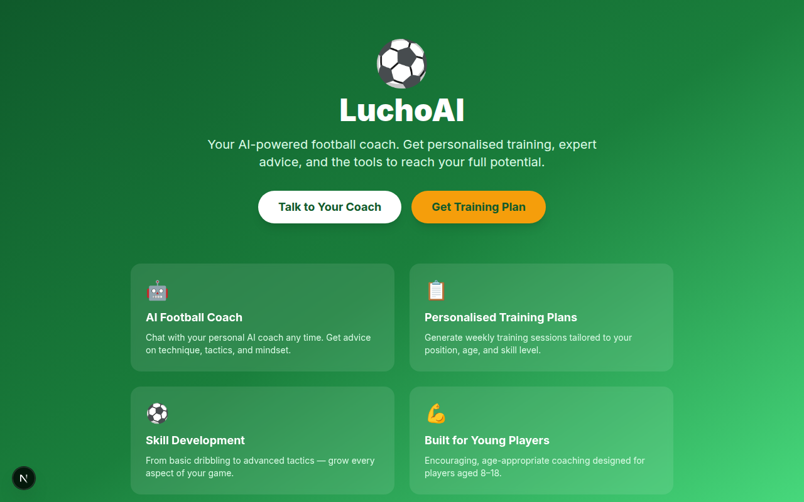
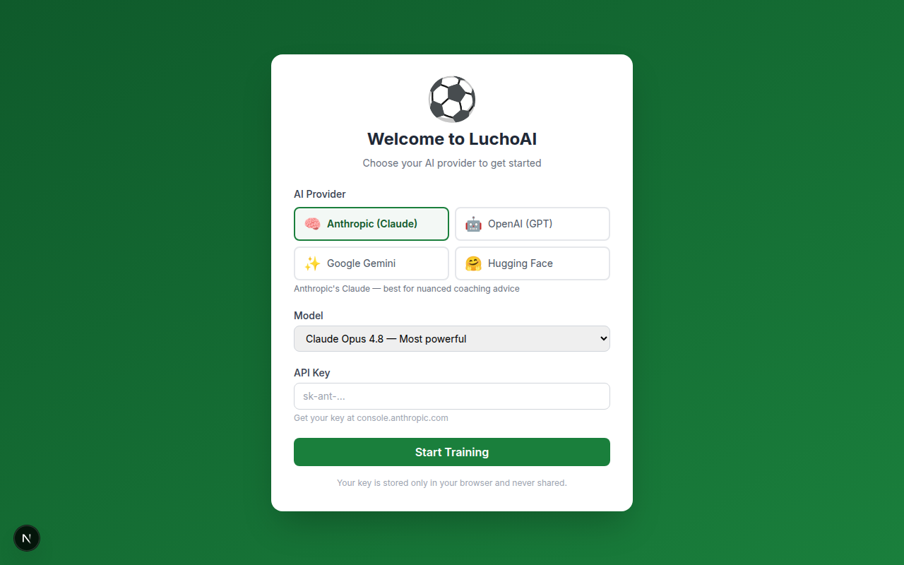

# LuchoAI ⚽

An AI-augmented coaching platform for young football (soccer) players aged 8–18. Get personalized training plans, technical skill advice, and tactical guidance powered by your choice of AI provider.



## Features

- **AI Coach Chat** — Ask your personal AI coach anything about football, technique, and tactics
- **Training Plan Generator** — Generate a personalized weekly training plan based on your position and skill level
- **Player Profile** — Set up your profile so coaching is tailored to your age, position, and goals
- **Multi-provider AI** — Choose from Anthropic Claude, OpenAI GPT, Google Gemini, or Hugging Face models



## AI Providers

LuchoAI supports four AI providers. You choose your provider and model on first launch; your API key is stored only in your browser.

| Provider | Models | Get a key |
|---|---|---|
| Anthropic (Claude) | Claude Opus 4.8, Sonnet 4.6, Haiku 4.5 | [console.anthropic.com](https://console.anthropic.com) |
| OpenAI (GPT) | GPT-4o, GPT-4o mini, GPT-4 Turbo | [platform.openai.com](https://platform.openai.com) |
| Google Gemini | Gemini 2.0 Flash, 1.5 Pro, 1.5 Flash | [aistudio.google.com](https://aistudio.google.com) |
| Hugging Face | Mistral 7B, Zephyr 7B, Llama 3.1 8B | [huggingface.co/settings/tokens](https://huggingface.co/settings/tokens) |

## Quick Start

```bash
npm install
npm run dev
```

Open [http://localhost:3000](http://localhost:3000), choose your AI provider, select a model, and enter your API key to start.

## Architecture

Fully static Next.js site — no server. All AI calls go directly from the browser to the provider's API using the key you enter. The multi-provider routing lives in `src/lib/claude.ts`; provider definitions (models, key validation, hints) are in `src/lib/providers.ts`.

```
src/lib/
  claude.ts      # Unified AI client — dispatches to the right provider SDK
  providers.ts   # Provider + model definitions (name, logo, key hints)
  storage.ts     # localStorage helpers — provider config + player profile
```

## Environment Variables

No server-side secrets. For local development, create `.env.local` (gitignored):

```
NEXT_PUBLIC_ANTHROPIC_API_KEY=sk-ant-...   # pre-fills the API key field for Anthropic
NEXT_PUBLIC_BASE_PATH=                      # leave empty for local dev
```

## Deploy

This app is deployed as a static site on GitHub Pages. Enable GitHub Pages in repo **Settings → Pages → Source: GitHub Actions**, then push to `main`.

Live URL: `https://ale-sanchez-g.github.io/luchoAI/`

## Development

See [CLAUDE.md](./CLAUDE.md) for full architecture, conventions, and AI integration details.
